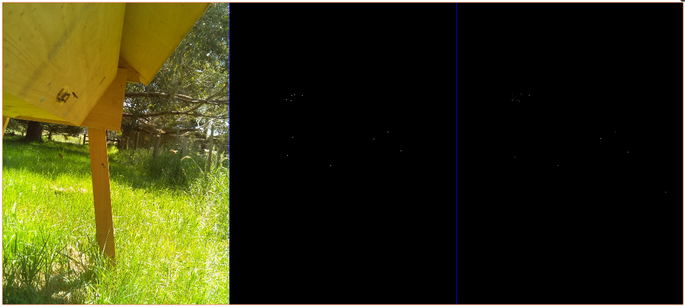
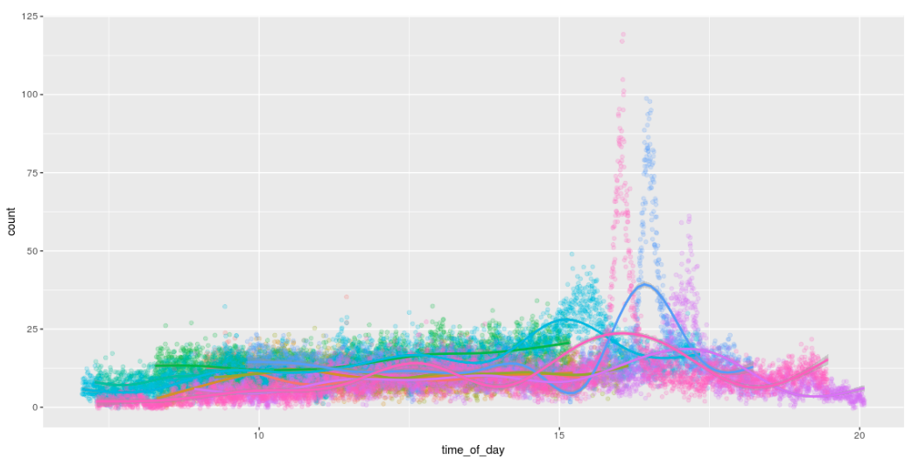

# BNN v2

unet style image translation from image of hive entrance to bitmap of location of center of bees.

trained in a semi supervised way on a desktop gpu and deployed to run in real time on the hive using
either a [raspberry pi](https://www.raspberrypi.org/) using a [neural compute stick](https://developer.movidius.com/)
or a [je vois embedded smart camera](http://jevois.org/)

blog post coming soon......

